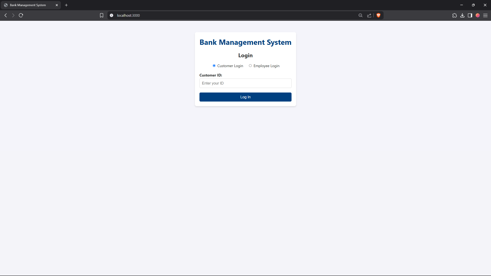
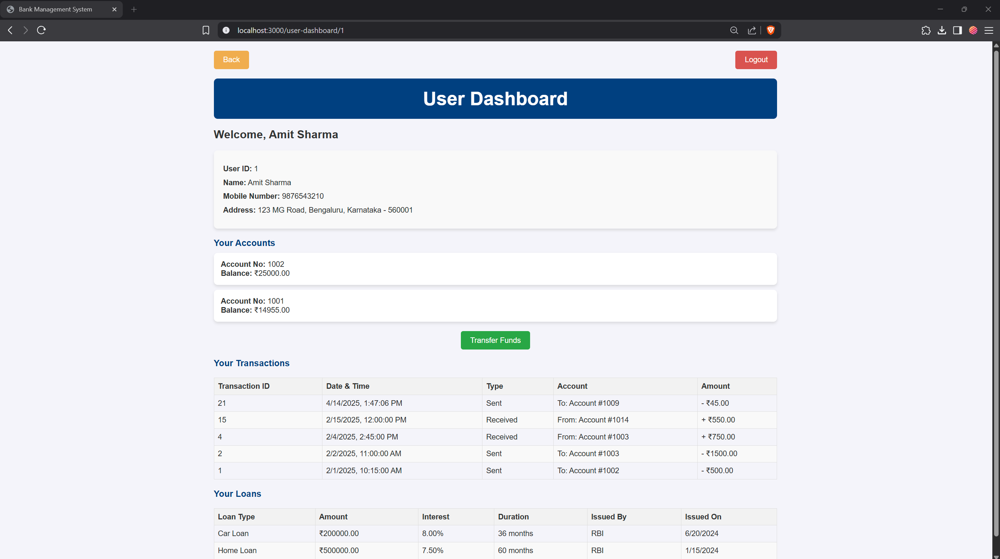
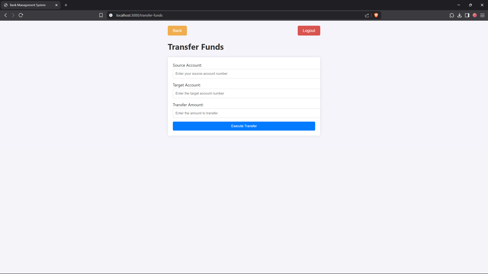
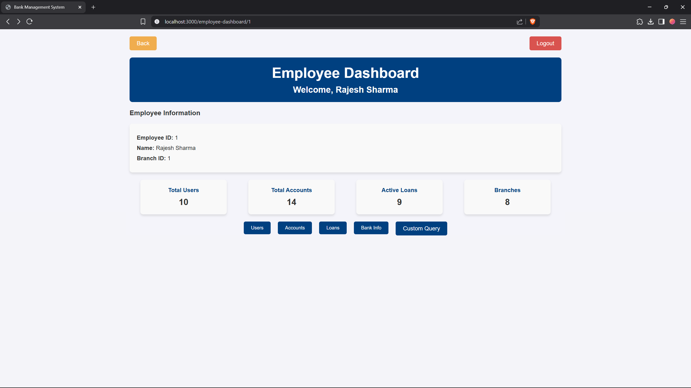
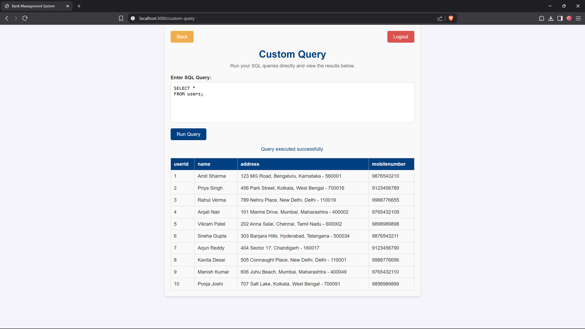

# Bank Management System

## Project Overview

The **Bank Management System** is a web-based application designed to manage banking operations efficiently. It provides functionalities for both employees and users (customers) of the bank. Employees can manage users, accounts, loans, and other banking data, while users can view their accounts, transactions, and loans, and perform fund transfers.

---

## Features

### User Features:
- **Dashboard:** View user details, accounts, transactions, and loans.
- **Fund Transfer:** Transfer funds between accounts with real-time balance updates.
- **Loan Details:** View loan details including loan type, amount, interest, duration, and issuing bank.
- **Transactions:** View all transactions associated with the user's accounts.

### Employee Features:
- **Dashboard:** View employee details and statistics, including total users, accounts, loans, and branches.
- **User Management:** View and manage user details.
- **Account Management:** View and manage account details.
- **Loan Management:** View and manage loan details.
- **Custom Queries:** Execute custom SQL queries for advanced operations.


---

## Technologies Used

### Frontend:
- **React.js:** For building the user interface.
- **CSS:** For styling the application.

### Backend:
- **Node.js:** For building the server-side application.
- **Express.js:** For handling API requests.
- **PostgreSQL:** For managing the database (with pgAdmin4 for administration).

---

## Installation and Setup

### Prerequisites:
- **Node.js** (v14 or higher)
- **PostgreSQL** (v12 or higher)
- **npm** (Node Package Manager)

### Steps:

1. **Clone the Repository:**
   ```bash
   git clone https://github.com/your-username/Bank-Management-System.git
   cd Bank-Management-System
   ```

2. **Set Up the Backend:**
   - Navigate to the backend directory:
     ```bash
     cd bank-backend
     ```
   - Install dependencies:
     ```bash
     npm install
     ```
   - **Configure the PostgreSQL Database:**  
     Edit `index.js` to include your database credentials. For example:
     ```javascript
     const pool = new Pool({
       user: 'your-username',    // e.g., 'postgres'
       host: 'localhost',
       database: 'bank',
       password: 'your-password',
       port: 5432,
     });
     ```
   - **Endpoints Implemented:**  
     - `/customer/:customerId` – Fetch customer details.
     - `/customer/:customerId/accounts` – Fetch accounts for a user.
     - `/customer/:customerId/transactions` – Fetch transactions for a user.
     - `/customer/:customerId/loans` – Fetch loans for a user.
     - `/transfer-funds` – Process a fund transfer between accounts.
     - `/employee/:employeeid` – Fetch employee details.
     - `/custom-query` – Execute custom SQL queries.
   - Start the backend server:
     ```bash
     node index.js
     ```

3. **Set Up the Frontend:**
   - Navigate to the frontend directory:
     ```bash
     cd ../bank-frontend
     ```
   - Install dependencies:
     ```bash
     npm install
     ```
   - Start the frontend server:
     ```bash
     npm start
     ```

4. **Access the Application:**
   - Open your browser and navigate to:
     ```
     http://localhost:3000
     ```

---

## Project Structure

### Backend (`bank-backend`):
- **`index.js`**: Main server file handling API endpoints.
- **Key Endpoints**:
  - **Customer Endpoints:**
    - `/customer/:customerId` – Fetch customer details.
    - `/customer/:customerId/accounts` – Fetch accounts.
    - `/customer/:customerId/transactions` – Fetch transactions.
    - `/customer/:customerId/loans` – Fetch loans.
  - **Transfer Endpoint:**
    - `/transfer-funds` – Executes a transaction that locks account tables, updates balances, and records transaction history.
  - **Employee Endpoints:**
    - `/employee/:employeeid` – Fetch employee details.
  - **Custom Query Endpoint:**
    - `/custom-query` – Allows execution of custom SQL queries.

### Frontend (`bank-frontend`):
- **`src/components/`**:
  - `CustomerDashboard.js` – User dashboard component showing personal details, accounts, transactions, loans, and a link to the Transfer Funds page.
  - `EmployeeDashboard.js` – Employee dashboard component for managing users, accounts, and viewing statistics.
  - `TransferFunds.js` – Fund transfer component that accepts source account, destination account, and transfer amount.
  - `CustomQuery.js` – Component to execute custom SQL queries.
  - `LoginPage.js` – Component for user/employee login.
- **`src/App.js`** – Main application file for routing.
- **`src/App.css`** (or your custom CSS file) – Global styling for the application.
- **Example CSS Styles:**  
  (Includes classes such as `customer-dashboard-container`, `dashboard-header`, and `transfer-button` for a polished UI.)

---

## Usage

### For Users:
1. **Login:**  
   Log in with your user credentials.
2. **Dashboard:**  
   View your personal details, accounts, transactions, and loans on the dashboard.
3. **Fund Transfer:**  
   Navigate to the **Transfer Funds** page using the dedicated button, enter your source account, destination account, and the amount, and then execute the transfer.

### For Employees:
1. **Login:**  
   Log in with your employee credentials.
2. **Dashboard:**  
   View your details and overall branch statistics.
3. **Management:**  
   Manage user details, account data, and loan details.
4. **Custom Queries:**  
   Use the **Custom Query** tool for advanced SQL operations.

---

## Screenshots


### User Dashboard:
- Displays user details, accounts, transactions, and loans.


- Includes a dedicated section for fund transfers resembling the provided design.



### Employee Dashboard:
- Displays employee details and statistics for managing branch operations.


- Provides custom query execution capabilities.


---


## Contributors

- Chirag Yadav
- Abhishek Rao
- Aryamaan Singh
- Aryan Dahiya

---

